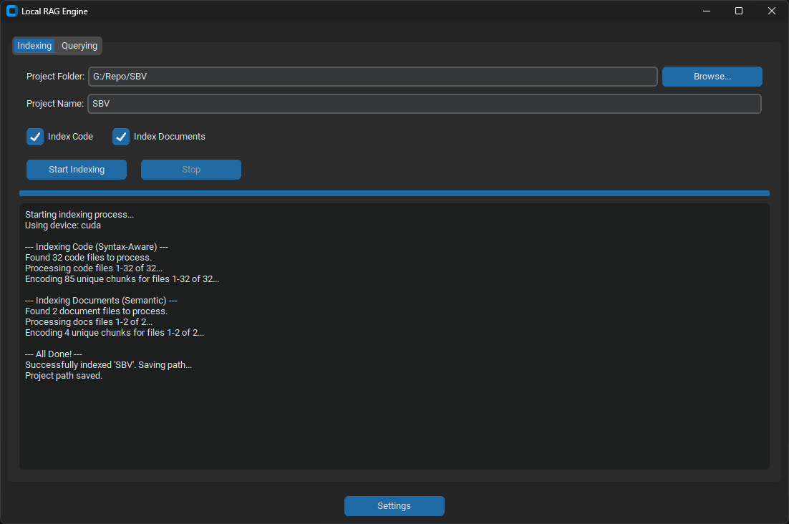
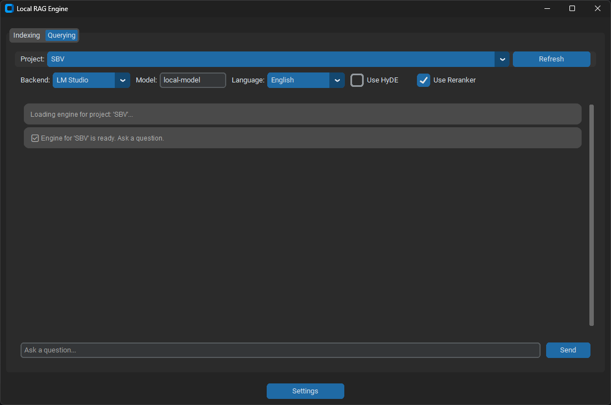
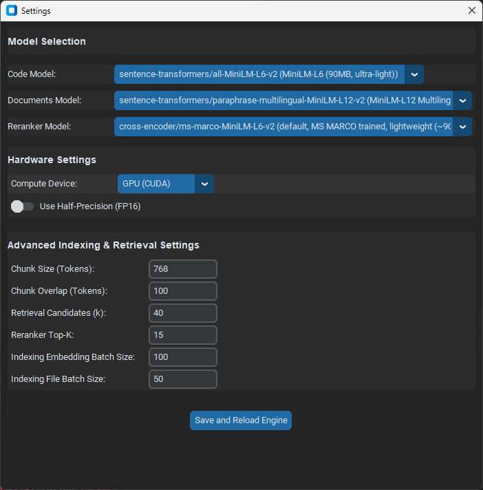

# Local RAG Engine for Code and Documents

A sophisticated local RAG (Retrieval-Augmented Generation) application with a graphical user interface built using CustomTkinter. This application allows you to create searchable indexes from local repositories of source code and documents, then ask complex natural language questions about your knowledge base using a local Large Language Model (LLM) running via Ollama or LM Studio.

The application features an advanced RAG pipeline with modern techniques to ensure high-quality, relevant answers.

## Key Features ✨

* **Intuitive GUI**: Easy-to-use CustomTkinter interface for indexing, searching, and configuration.
* **Hybrid Knowledge Base**: Creates separate, specialized vector indexes for source code and documents for optimal retrieval accuracy.
* **Flexible Model Selection**: Comes with lightweight, high-performance default models and allows choosing larger, more powerful alternatives from a curated list.
    * **Default Document Model**: `sentence-transformers/paraphrase-multilingual-MiniLM-L12-v2` (471MB)
    * **Default Code Model**: `sentence-transformers/all-MiniLM-L6-v2` (90MB)
    * **Default Re-ranker**: `cross-encoder/ms-marco-MiniLM-L6-v2` (90MB)
* **Advanced RAG Pipeline**: Implements modern techniques for superior quality:
    * **HyDE** (Hypothetical Document Embeddings): Transforms user queries for better conceptual matching.
    * **Cross-Encoder Re-ranking**: Intelligently re-ranks search results for maximum relevance.
    * **Syntax-Aware Code Chunking**: Uses `tree-sitter` to split code along logical boundaries (functions, classes).
    * **Semantic Document Chunking**: Uses semantic chunking for documents to preserve context.
* **Advanced Configuration**: Fine-tune performance with GUI controls for chunking, batch sizes, and retrieval parameters.
* **Memory Efficient**: JIT (Just-In-Time) loading and unloading of models to minimize VRAM usage.
* **Local-First Operation**: Automatically uses downloaded models from the `./models` directory, enabling full offline capability.
* **Cross-Platform**: Works on Windows (`.bat`) and Linux/macOS (`.sh`) with automated setup scripts.
* **Multi-Language Support**: Automatically detects query language and responds accordingly.
* **OpenAI-Compatible**: Supports any OpenAI-compatible API (LM Studio, Ollama, etc.).

## Architecture 🏛️

The application is organized into three main Python modules:

* **`app.py`**: CustomTkinter GUI implementation with threading for a responsive user experience.
* **`rag_core.py`**: Complete indexing pipeline including file discovery, text extraction, and intelligent chunking.
* **`rag_core_query_engine.py`**: `HybridRAGQueryEngine` class that orchestrates the full query process.

### Supported File Types

**Code Files**: `.py`, `.js`, `.ts`, `.java`, `.go`, `.cpp`, `.c`, `.h`, `.hpp`, `.php`, `.sql`
**Documents**: `.md`, `.txt`, `.pdf`, `.docx`, `.xlsx`, `.doc`

### Query Pipeline

```mermaid
graph TD
    A[User Query] --> B{LLM: HyDE<br>Generate Hypothetical Answer};
    B --> C[Vector Search<br>Retrieve Top Candidates from Code and Doc Indexes];
    C --> D{Cross-Encoder<br><b>Re-rank</b> Candidates based on relevance to Original Query};
    D --> E[Top Context Snippets];
    E --> F{LLM: Generation<br><b>Consolidated & Structured Prompt</b><br>Answer question using best snippets};
    F --> G[Formatted Markdown Answer with Citations];
````

## 🚀 Setup and Installation

### Prerequisites

  * **Python 3.8-3.12**
  * **Operating System**: Windows, Linux, or macOS
  * **Local LLM Server**: [LM Studio](https://lmstudio.ai/) or [Ollama](https://ollama.com/) with a loaded model.
  * **Disk Space**: \~3-5GB for all embedding models.
  * **Memory**: 8GB+ RAM recommended (4GB+ VRAM for GPU acceleration).

### Quick Start

1.  **Download/Clone**: Place all project files in the same directory.
2.  **Run Launcher**:
      * **Windows**: Double-click `start.bat`
      * **Linux/macOS**: Run `./start.sh` (make it executable first with `chmod +x start.sh`)

The launcher automatically:

  - Creates a Python virtual environment (`.venv`).
  - Installs all dependencies from `requirements.txt`.
  - Downloads all required embedding and reranker models on the first run.
  - Launches the GUI application.

## How to Use 📖

### 1\. Indexing Your Data

1.  Open the **Indexing** tab.
2.  Click **"Browse..."** to select your project or document folder.
3.  The **Project Name** auto-fills from the folder name (you can edit it).
4.  Choose what to index:
      * ☑️ **Index Code**: Processes code files with syntax-aware chunking.
      * ☑️ **Index Documents**: Processes documents with semantic chunking.
5.  Click **"Start Indexing"**. Progress is shown in real-time.

### 2\. Querying Your Knowledge Base

1.  Switch to the **Querying** tab.
2.  Select your indexed project from the dropdown menu.
3.  Configure your backend:
      * **Backend**: Choose LM Studio or Ollama.
      * **Model Name**: Enter the name of your loaded model (e.g., `llama3`).
4.  Query options (enabled by default for best quality):
      * ☑️ **Use HyDE**: Improves query understanding.
      * ☑️ **Use Reranker**: Provides better result ranking.
5.  Type your question and click **"Send"** or press Enter.

### 3\. Settings Configuration

Click the **"Settings"** button to customize:

  * **Models**: Select from a curated list of high-quality embedding and reranker models.
  * **Hardware**: Choose the compute device (Auto/GPU/CPU) and enable/disable half-precision (FP16) for performance tuning on CUDA devices.
  * **Advanced Indexing & Retrieval**: Fine-tune parameters like chunk sizes, retrieval candidates (k), and batch sizes for indexing.

Settings are saved to `config.json` and reloaded when the engine is started or reloaded.

## Screenshots 📷






