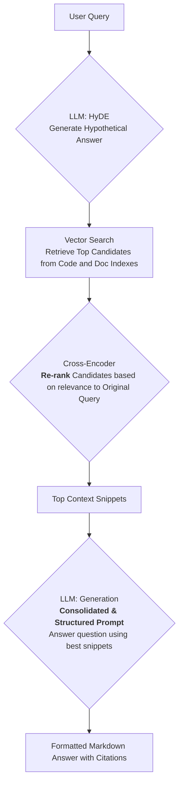

# Local RAG Engine for Code and Documents

A sophisticated local RAG (Retrieval-Augmented Generation) application with a graphical user interface built using CustomTkinter. This application allows you to create searchable indexes from local repositories of source code and documents, then ask complex natural language questions about your knowledge base using a local Large Language Model (LLM) running via Ollama or LM Studio.

The application features an advanced RAG pipeline with modern techniques to ensure high-quality, relevant answers.

## Key Features ✨

* **Intuitive GUI**: Easy-to-use CustomTkinter interface for indexing, searching, and configuration
* **Hybrid Knowledge Base**: Creates separate, specialized vector indexes for source code and documents for optimal retrieval accuracy
* **Best-in-Class Models**: Uses state-of-the-art open-source models with default configurations for:
  * Document embeddings (`intfloat/multilingual-e5-large-instruct`)
  * Code embeddings (`jinaai/jina-embeddings-v2-base-code`) 
  * Re-ranking (`Qwen/Qwen3-Reranker-0.6B`)
* **Advanced RAG Pipeline**: Implements modern techniques for superior quality:
  * **HyDE** (Hypothetical Document Embeddings): Transforms user queries for better conceptual matching
  * **Cross-Encoder Re-ranking**: Intelligently re-ranks search results for maximum relevance
  * **Syntax-Aware Code Chunking**: Uses `tree-sitter` to split code along logical boundaries (functions, classes)
  * **Semantic Document Chunking**: Uses semantic chunking for documents to preserve context
  * **Smart Deduplication**: Prevents duplicate content in the knowledge base
* **Memory Efficient**: JIT loading and unloading of models to minimize VRAM usage
* **Cross-Platform**: Works on Windows (`.bat`) and Linux/macOS (`.sh`) with automated setup scripts
* **Offline Capable**: Can operate completely offline once models are downloaded
* **Multi-Language Support**: Automatically detects query language and responds accordingly
* **OpenAI-Compatible**: Supports any OpenAI-compatible API (LM Studio, Ollama, etc.)

## Architecture 🏛️

The application is organized into three main Python modules:

* **`app.py`**: CustomTkinter GUI implementation with threading for responsive user experience
* **`rag_core.py`**: Complete indexing pipeline including file discovery, text extraction, and intelligent chunking
* **`rag_core_query_engine.py`**: `HybridRAGQueryEngine` class that orchestrates the full query process

### Supported File Types

**Code Files**: `.py`, `.js`, `.ts`, `.java`, `.go`, `.cpp`, `.c`, `.h`, `.hpp`, `.php`, `.sql`
**Documents**: `.md`, `.txt`, `.pdf`, `.docx`, `.xlsx`, `.doc`

### Query Pipeline


```


## 🚀 Setup and Installation

### Prerequisites

* **Python 3.8-3.12** (recommended)
* **Operating System**: Windows, Linux, or macOS
* **Local LLM Server**: [LM Studio](https://lmstudio.ai/) or [Ollama](https://ollama.com/) with a loaded model
* **Disk Space**: ~3-5GB for embedding models
* **Memory**: 8GB+ RAM recommended (4GB+ VRAM for GPU acceleration)

### Quick Start

1. **Download/Clone**: Place all project files in the same directory
2. **Run Launcher**: 
   - **Windows**: Double-click `start.bat`
   - **Linux/macOS**: Run `./start.sh` (make executable with `chmod +x start.sh`)

The launcher automatically:
- Creates a Python virtual environment (`.venv`)
- Installs all dependencies from `requirements.txt`
- Downloads embedding models on first run (~2-3GB)
- Launches the GUI application

### Manual Installation

If you prefer manual setup:

```shell script
# Create virtual environment
python -m venv .venv

# Activate environment
# Windows:
.venv\Scripts\activate
# Linux/macOS:
source .venv/bin/activate

# Install dependencies
pip install -r requirements.txt

# Download models (first time only)
python download_models.py

# Run application
python app.py
```


## How to Use 📖

### 1. Indexing Your Data

1. Open the **Indexing** tab
2. Click **"Browse..."** to select your project/document folder
3. The **Project Name** auto-fills from folder name (editable)
4. Choose what to index:
   - ☑️ **Index Code**: Processes code files with syntax-aware chunking
   - ☑️ **Index Documents**: Processes documents with semantic chunking
5. Click **"Start Indexing"** - progress shown in real-time
6. Use **"Stop"** to interrupt if needed

### 2. Querying Your Knowledge Base

1. Switch to the **Querying** tab
2. Select your indexed project from the dropdown
3. Configure your backend:
   - **Backend**: Choose LM Studio or Ollama
   - **Model Name**: Enter your loaded model (e.g., `llama3.2:3b`)
4. Query options (enabled by default for best quality):
   - ☑️ **Use HyDE**: Improves query understanding
   - ☑️ **Use Reranker**: Better result ranking
5. Type your question and click **"Send"** or press Enter
6. Watch the streaming response with automatic citations

### 3. Settings Configuration

Click **"Settings"** to customize:

- **Models**: Select from curated high-quality embedding and reranker models
- **Hardware**: Choose compute device (Auto/GPU/CPU) and precision settings
- **Advanced**: Tweak chunk sizes and retrieval parameters

Settings are saved to `config.json` and applied immediately.

## Technical Details 🔧

### Chunking Strategies

- **Code**: Tree-sitter AST parsing for function/class boundaries
- **Documents**: Semantic chunking preserving contextual meaning
- **Fallback**: Character-based splitting with overlap

### Model Management

- JIT loading: Models loaded only when needed
- Automatic unloading: Frees VRAM after use
- CUDA optimization: Half-precision (FP16) support
- CPU compatibility: Graceful fallback for non-GPU systems

### Database

- **ChromaDB**: Persistent vector storage
- **Collections**: Separate indexes for code and documents
- **Deduplication**: SHA256-based content hashing
- **Metadata**: Source file tracking for citations

## Configuration Files

- `config.json`: User settings (auto-generated)
- `requirements.txt`: Python dependencies
- `start.bat`/`start.sh`: Platform-specific launchers

## Troubleshooting 🔧

- **Models not downloading**: Check internet connection and disk space
- **CUDA errors**: Ensure PyTorch CUDA version matches your GPU drivers
- **Memory issues**: Reduce batch sizes in settings or use CPU mode
- **API connection failed**: Verify your LLM server is running and accessible

## Contributing

This project uses modern RAG techniques and is designed for extensibility. Key areas for contribution include additional file format support, new chunking strategies, and performance optimizations.